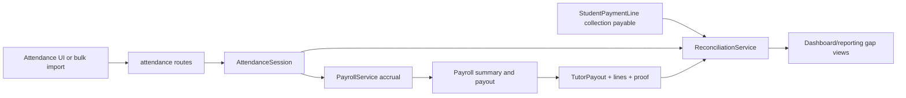

# Attendance To Payroll To Reconciliation

## Purpose

Keep tutor attendance accrual, payroll balances, payouts, reconciliation gaps, dashboard values, and reports aligned.

## Source Of Truth

- Attendance accrual: `AttendanceSession` rows with tutor, subject, date, status, and nominal/fee context
- Payout state: `TutorPayout`, `TutorPayoutLine`, and `TutorPayoutProof` in `app/models/payroll.py`
- Collection-based payable: `StudentPaymentLine` rows connected to paid student sessions
- Reconciliation: `ReconciliationService` in `app/services/reconciliation_service.py`

## Entry Points

- `app/routes/attendance.py`: `add_attendance`, `edit_attendance`, `delete_attendance`, `bulk_add_attendance`, `monthly_summary`, `export_attendance_csv`
- `app/routes/payroll.py`: payout creation, payout detail, payment status, fee slip verification
- `app/routes/tutor_portal.py`: read-only tutor payout slip route `payout_detail`
- `app/services/payroll_service.py`: `get_tutor_payable_from_attendance`, `get_tutor_paid_amount`, `get_tutor_balance`, `create_payout`, `get_payroll_summary`
- `app/services/reconciliation_service.py`: `get_payable_from_collection`, `get_accrual_from_attendance`, `get_total_payout`, `get_reconciliation_gap_analysis`
- `app/services/dashboard_service.py`: payroll, payable, profit, and balance summaries

## Route And Service Path

1. Attendance creates or updates accrual basis for tutor fees.
2. Payroll service summarizes attendance accrual and already-paid payout totals.
3. Payout workflow records actual tutor payments and proof files.
4. Reconciliation compares collection-based payable, attendance accrual, and total payout.
5. Dashboard/reporting consume aggregate service results.

## User-Facing Surfaces

- Attendance list, calendar, monthly summary, CSV export
- Payroll list/detail/payout/fee slip
- Tutor portal slip gaji detail
- Reconciliation dashboards
- Owner dashboard and reports

## Invariants

- Attendance mutation must preserve tutor, student, subject, curriculum, level, date, status, and fee context.
- Payroll payout must not delete or rewrite attendance accrual history.
- Tutor portal fee-slip detail must remain read-only and scoped to the logged-in tutor.
- Reconciliation must expose differences instead of hiding them.
- Dashboard values must be traceable to payment, attendance, payout, and closing records.
- Locked attendance periods must block unsafe edits.

## Known Fragility

- Attendance date/month normalization affects payroll and reconciliation.
- Payout records can make a tutor look paid while attendance accrual still has unresolved gaps.
- Payroll fee-slip template changes can affect both admin payroll and tutor portal slip pages.
- Collection-based payable and attendance accrual are intentionally different views and must not be conflated.

## Required Checks

- `openspec validate --specs --strict --no-interactive`
- Attendance tests when list/export/filter behavior changes
- Payroll/reconciliation tests when fee or payout formulas change
- Container bootstrap if route/service imports change

## Diagram

