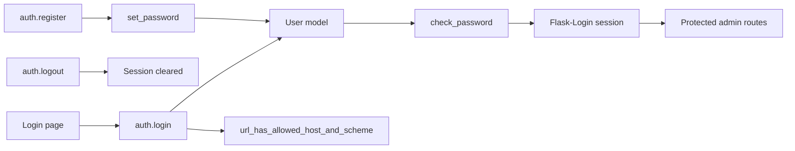

# Auth Admin Session Security

## Purpose

Map admin authentication, registration, logout, session safety, and redirect handling.

## Source Of Truth

- Admin user records: `User` in `app/models/master.py`
- Password hashing: `User.set_password` and `User.check_password`
- Session ownership: Flask-Login
- Auth routes: `app/routes/auth.py`
- Safe redirect helper: `url_has_allowed_host_and_scheme`

## Entry Points

- `login`
- `logout`
- `register`
- `url_has_allowed_host_and_scheme`

## Route And Service Path

1. User opens `/auth/login`.
2. Login verifies username/password against `User.check_password`.
3. Flask-Login stores authenticated session state.
4. Safe redirect helper validates `next` before redirecting.
5. Logout clears Flask-Login session.
6. Registration creates a user only through the auth blueprint path.

## User-Facing Surfaces

- Login page
- Register page
- Logout action
- Auth-gated admin pages across dashboard, master, attendance, payments, payroll, reports, WhatsApp, and data manager

## Invariants

- Passwords must never be stored or logged in plaintext.
- Redirect targets must be local/safe.
- Auth-gated routes must not expose sensitive data to anonymous users.
- Registration behavior must remain deliberate and not accidentally open privileged access.
- Secret/session values must not be printed during debugging.

## Known Fragility

- Open redirects can appear in login `next` handling.
- Auth gating can hide template/runtime errors by redirecting during verification.
- Registration rules affect who can access high-risk admin surfaces.

## Required Checks

- `openspec validate --specs --strict --no-interactive`
- Focused auth tests for login/logout/register and safe redirect behavior when auth changes
- Manual anonymous/authenticated route checks for sensitive admin pages
- Secret-redacted environment/session diagnostics only

## Diagram

