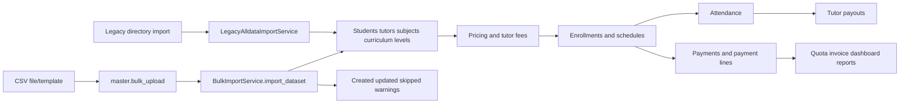

# Bulk Upload Import Order

## Purpose

Map current CSV bulk import and legacy import paths so imported data preserves dependency order and source-of-truth records.

## Source Of Truth

- Current CSV definitions: `DATASET_DEFINITIONS` in `app/services/bulk_import_service.py`
- Current import entry route: `master.bulk_upload`
- Template download route: `master.download_bulk_template`
- Legacy import definitions and redirects: `app/services/legacy_alldata_import_service.py`
- Canonical records: master, pricing, enrollment, attendance, payment, income, expense, and payout models

## Entry Points

- `app/routes/master.py`: `bulk_upload`, `download_bulk_template`
- `BulkImportService.import_dataset`
- Dataset import methods: `_import_students`, `_import_tutors`, `_import_pricing_rates`, `_import_tutor_fees`, `_import_enrollments`, `_import_attendance`, `_import_payments`, `_import_incomes`, `_import_expenses`, `_import_tutor_payouts`
- Legacy path: `LegacyAlldataImportService.import_directory`

## Route And Service Path

1. Admin downloads or prepares dataset CSV template.
2. `bulk_upload` receives a dataset key and file payload.
3. `BulkImportService` reads CSV, normalizes headers and values, and routes to dataset-specific import methods.
4. Imports create or match master data, pricing, enrollments, attendance, payments, income, expenses, and tutor payouts.
5. Result counts show created, updated, skipped, and warning outcomes.
6. Legacy directory import remains separate and handles historical matching, redirects, period parsing, and cleanup.

## User-Facing Surfaces

- Master bulk upload page
- Dataset template download links
- Import result summary
- Existing list/detail pages receiving imported records

## Invariants

- Safe import order is master data -> pricing -> enrollments -> attendance -> payments -> incomes/expenses -> tutor payouts.
- Imported payments must create payment lines when session/payment data requires quota and invoice visibility.
- Imported attendance must preserve tutor, student, subject, date, status, and fee context.
- Legacy import cleanup rules must not affect current CSV import unexpectedly.
- Warnings and skipped rows must remain visible to the admin.

## Known Fragility

- Name matching for students/tutors can create duplicates if normalization changes.
- Period/month parsing affects payment, payout, dashboard, and reporting totals.
- Importing dependent datasets before prerequisites causes partial records or skipped rows.
- Legacy redirects and exclusions are historical business rules and should not be casually removed.

## Required Checks

- `openspec validate --specs --strict --no-interactive`
- Focused import tests when dataset definitions or parsing changes
- Manual import dry-run on a safe sample before live import changes
- Quota, attendance, payroll, and dashboard checks when imported data touches those flows

## Diagram

