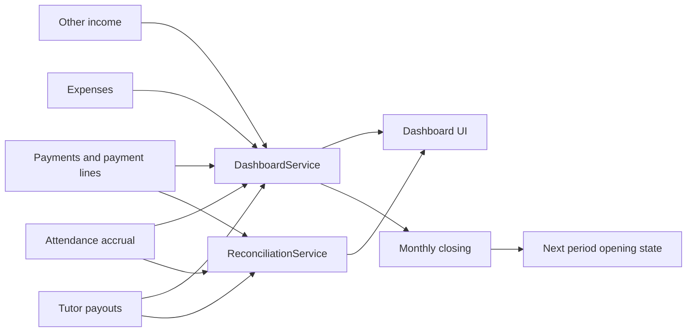

# Closing To Dashboard Balance

## Purpose

Keep monthly opening balance, cash movement, tutor payable, estimated profit, closing state, and dashboard reporting consistent across periods.

## Source Of Truth

- Student payment and payment line records for income and tutor payable from collection
- Other income records
- Expense records
- Attendance and payout records for tutor accrual and paid amounts
- Monthly closing records for locked period continuity
- `DashboardService` and `ReconciliationService` for aggregate calculations

## Entry Points

- `app/routes/dashboard.py`: owner/dashboard views
- `app/routes/closings.py`: create and view monthly closing
- `app/routes/incomes.py` and `app/routes/expenses.py`: non-student cash movement
- `app/routes/payments.py`, `app/routes/attendance.py`, `app/routes/payroll.py`: source events
- `app/services/dashboard_service.py`: `get_opening_balance`, `get_cash_balance`, `get_grand_tutor_payable`, `get_estimated_profit`, `get_monthly_trend`, reconciliation helpers
- `app/services/reconciliation_service.py`: reconciliation gap calculations

## Route And Service Path

1. Operational events create payment, income, expense, attendance, and payout rows.
2. Dashboard service calculates period income, expenses, tutor payable, margin, cash balance, and estimated remaining balance.
3. Closing route stores period-end values where the workflow requires a fixed monthly boundary.
4. Later dashboard periods derive opening state from prior data and closing records.
5. Reconciliation views show gaps that should not be hidden inside dashboard totals.

## User-Facing Surfaces

- Main dashboard
- Monthly trend and summary panels
- Closing list/detail/create
- Income and expense summaries
- Payroll and reconciliation dashboards

## Invariants

- Opening balance for a period must be explainable from earlier period data or closing records.
- Dashboard totals must remain traceable to payment, income, expense, attendance, payout, and closing rows.
- Estimated profit is not a replacement for cash balance.
- Tutor payable must remain reconcilable with payroll and collection/accrual views.

## Known Fragility

- Month boundaries and date normalization can shift totals.
- Backdated edits after closing can make dashboard and closing records diverge.
- Dashboard formulas are shared business logic and must not be reimplemented in templates.

## Required Checks

- Dashboard service tests or focused calculation checks when formulas change
- Closing route checks when period behavior changes
- Reconciliation checks when tutor payable or payout formulas change
- Manual comparison of before/after totals for high-risk finance edits

## Diagram

