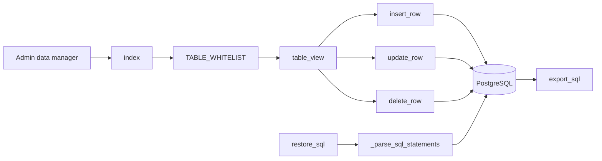

# Data Manager Export Restore Table Editor

## Purpose

Map the generic database management surface for table browsing, row mutation, SQL export, and SQL restore.

## Source Of Truth

- Database tables allowed by `TABLE_WHITELIST` in `app/routes/data_manager.py`
- WhatsApp table grouping: `WHATSAPP_TABLES`
- Mutation restrictions: `READONLY_COLUMNS`
- Export order: `EXPORT_TABLE_ORDER`
- Database state: PostgreSQL canonical rows

## Entry Points

- `index`
- `table_view`
- `delete_row`
- `update_row`
- `insert_row`
- `export_sql`
- `restore_sql`
- Helpers: `_require_whitelisted_table`, `_require_mutable_table`, `_parse_sql_statements`, `_value_to_sql`

## Route And Service Path

1. Admin opens data manager index and sees whitelisted tables with row counts and DB size.
2. Admin opens a specific table through `table_view`.
3. Insert/update/delete routes validate the target table and columns before mutating rows.
4. SQL export serializes whitelisted tables in documented order.
5. SQL restore parses submitted SQL statements and executes allowed restore flow.

## User-Facing Surfaces

- Data manager index
- Table view/editor
- Row insert/update/delete forms
- SQL export download
- SQL restore upload/form

## Invariants

- Generic editor must never bypass route-level table whitelist.
- Read-only columns must not be mutated through the generic editor.
- Export must not silently omit critical canonical tables in the documented order.
- Restore must be treated as high-risk and should not be mixed with normal business workflows.
- Secrets and auth files are not data-manager export targets.

## Known Fragility

- Generic table editing can corrupt business invariants if whitelist/mutability is too broad.
- Restore can overwrite rows that dashboard, payment, quota, payroll, and WhatsApp workflows depend on.
- SQL parsing is not a substitute for a tested migration or repair script.

## Required Checks

- `openspec validate --specs --strict --no-interactive`
- Route checks for whitelist and read-only behavior
- Backup before destructive restore in live environment
- Container/database status check when restore/export behavior changes

## Diagram

