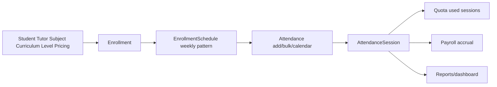

# Enrollment To Schedule To Attendance

## Purpose

Keep enrollment commitments, recurring schedules, attendance creation, tutor fee context, and session quota calculations connected.

## Source Of Truth

- Student and tutor identity: `Student` and `Tutor` in `app/models/master.py`
- Subject/curriculum/level/pricing: master models and pricing records
- Learning commitment: `Enrollment` in `app/models/enrollment.py`
- Weekly schedule: `EnrollmentSchedule` in `app/models/enrollment.py`
- Actual lesson occurrence: `AttendanceSession` in `app/models/attendance.py`

## Entry Points

- `app/routes/enrollments.py`: enrollment CRUD and schedule workflow
- `app/routes/master.py`: student/tutor detail, subject-tutor relationships, pricing
- `app/routes/attendance.py`: attendance add/edit/bulk add/calendar
- `app/services/enrollment_service.py`: enrollment creation and service logic
- `app/services/bulk_import_service.py`: CSV import for master data, pricing, enrollments, attendance

## Route And Service Path

1. Master data defines student, tutor, subject, curriculum, level, and pricing.
2. Enrollment binds a student to service terms, tutor, subject, rate, fee, and meeting quota.
3. Enrollment schedules define the expected weekly lesson pattern.
4. Attendance records actual lessons and should retain enough context for quota, payroll, dashboard, and reporting.
5. Bulk import must preserve the same order: master data, pricing, enrollment, attendance.

## User-Facing Surfaces

- Student detail and active enrollments
- Tutor detail and schedule view
- Enrollment CRUD
- Attendance add/calendar/bulk add
- Bulk upload templates and imports

## Invariants

- Attendance should never lose its enrollment, tutor, subject, or fee context when such context is available.
- Enrollment changes must not corrupt historical attendance already used by payroll or invoices.
- Pricing and tutor fee changes affect future calculations deliberately; historical records should remain auditable.
- Bulk imports must create dependencies before dependent rows.

## Known Fragility

- Schedule changes can appear harmless but alter the expected attendance pattern.
- Missing enrollment context can break quota and payroll traceability later.
- Bulk imports are sensitive to ordering and identity matching.

## Required Checks

- Focused enrollment, attendance, and bulk import tests for changed workflows
- Manual check of student and tutor detail pages when schedule display changes
- Quota and payroll checks when attendance context is affected

## Diagram

