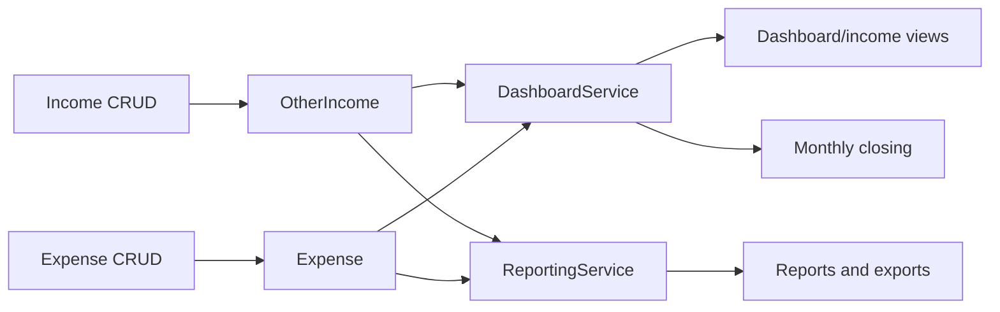

# Income Expense Cash Movement

## Purpose

Map non-student income and operational expense workflows so dashboard, closing, reports, and cash calculations remain consistent.

## Source Of Truth

- Other income rows: `OtherIncome` in `app/models/income.py`
- Expense rows: `Expense` in `app/models/expense.py`
- Dashboard calculations: `DashboardService`
- Closing state: `MonthlyClosing`
- Reports: `ReportingService`

## Entry Points

- Income routes: `list_incomes`, `add_income`, `edit_income`, `delete_income`, `income_summary`
- Expense routes: `list_expenses`, `add_expense`, `edit_expense`, `delete_expense`, `expense_summary`
- Dashboard consumers: `owner_dashboard`, `income_dashboard`, API KPI/trend routes
- Closing consumers: monthly closing create/detail/confirm/delete
- Reporting consumers: monthly report and exports

## Route And Service Path

1. Admin creates or edits other income through the income blueprint.
2. Admin creates or edits expense through the expense blueprint.
3. Dashboard service reads canonical income and expense rows for monthly cash movement.
4. Closing workflow freezes or displays period balance context.
5. Reporting service exports monthly totals using the same canonical rows.

## User-Facing Surfaces

- Income list/add/edit/delete/summary
- Expense list/add/edit/delete/summary
- Owner dashboard and income dashboard
- Monthly closing pages
- Monthly report and exports

## Invariants

- Other income is separate from student payment income.
- Expenses reduce cash/profit views according to dashboard service formulas.
- Deleting income/expense must update dashboard, closing previews, and reports.
- Backdated cash movement can affect historical closing/dashboard views and must be handled deliberately.
- Templates must not reimplement dashboard formulas.

## Known Fragility

- Date/month normalization affects period totals.
- Backdated edits after closing can make closing and dashboard views diverge.
- Student payments and other income must not be double-counted.

## Required Checks

- `openspec validate --specs --strict --no-interactive`
- Dashboard service or route checks when cash formulas change
- Income/expense route tests when CRUD behavior changes
- Manual monthly dashboard/report comparison for period-sensitive changes

## Diagram

