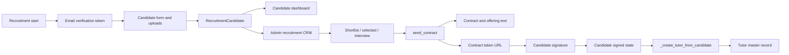

# Recruitment To Contract To Tutor

## Purpose

Map the applicant pipeline from public recruitment registration through candidate dashboard, admin CRM, contract signing, and tutor creation.

## Source Of Truth

- Candidate identity and status: `RecruitmentCandidate` in `app/models/recruitment.py`
- Candidate session: `recruitment_candidate_id` in Flask session
- Contract content/signature state: fields on `RecruitmentCandidate`
- Tutor identity after conversion: `Tutor` in `app/models/master.py`
- Uploads: recruitment upload storage paths served through the recruitment blueprint

## Entry Points

- `app/routes/recruitment.py`: `start`, `verify_email`, `form`, `dashboard`, `logout`
- Candidate files: `uploaded_file`
- CRM pages: `crm_candidates`, `crm_selected`, `crm_interview`
- CRM actions: `shortlist`, `send_interview_invite`, `agree_interview`, `send_contract`
- Contract signing: `contract`
- Conversion helper: `_create_tutor_from_candidate`

## Route And Service Path

1. Candidate starts recruitment at `/recruitment/`.
2. Email verification token is generated by `_send_recruitment_verification_email`.
3. Candidate completes the recruitment form, uploads required files, sets dashboard password, and enters candidate dashboard.
4. Admin CRM shortlists and advances candidates through selected/interview states.
5. Admin sends contract using `_build_contract_text`, `_build_offering_text`, `_contract_token`, `_contract_url`, and `_send_candidate_whatsapp`.
6. Candidate opens `/recruitment/contract/<token>` and signs through `_sign_candidate_contract`.
7. Candidate can be converted into a tutor through `_create_tutor_from_candidate`.

## User-Facing Surfaces

- Public recruitment start and verification pages
- Recruitment form
- Candidate dashboard
- Uploaded candidate files
- CRM candidate list, selected list, interview list
- Contract signing page
- Candidate WhatsApp/email communication

## Invariants

- Candidate dashboard must only expose the current candidate session.
- Contract tokens must include the correct purpose and candidate identity.
- Contract signing must only work for valid contract-sent candidates.
- Candidate uploads must not be publicly enumerable outside intended routes.
- Tutor creation from candidate must be deliberate and must not duplicate tutors.
- Communication must not leak verification or contract tokens in logs.

## Known Fragility

- Candidate status transitions drive which dashboard sections and CRM actions are valid.
- Contract text can be generated lazily when candidate dashboard or contract page opens.
- Candidate-to-tutor conversion touches both recruitment data and master tutor data.
- WhatsApp delivery failure can leave contract state updated but candidate not notified unless handled visibly.

## Required Checks

- `openspec validate --specs --strict --no-interactive`
- Focused recruitment tests when candidate status, contract, or conversion changes
- Template check for recruitment form, dashboard, CRM pages, and contract page
- Secret-redacted mail/WhatsApp configuration check when communication changes
- Container route bootstrap if recruitment imports or app startup change

## Diagram

