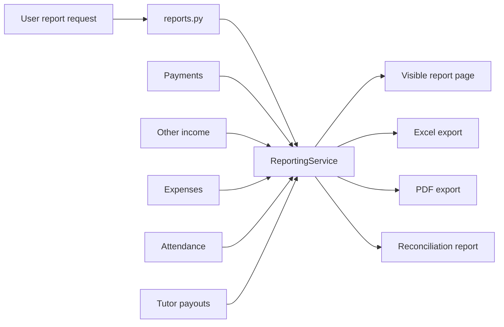

# Reports And Exports

## Purpose

Map report pages and exports so monthly, tutor, student, reconciliation, Excel, and PDF outputs remain aligned with visible service calculations.

## Source Of Truth

- Report route ownership: `app/routes/reports.py`
- Report calculations/export helpers: `ReportingService` in `app/services/reporting_service.py`
- Upstream records: student payments, other income, expenses, attendance, tutor payouts, closing, and reconciliation records

## Entry Points

- `reports_index`
- `monthly_report`
- `tutor_report`
- `student_report`
- `reconciliation_report`
- `export_report`
- `ReportingService.get_monthly_report`
- `ReportingService.get_tutor_report`
- `ReportingService.get_student_report`
- `ReportingService.export_to_excel`
- `ReportingService.export_to_pdf`

## Route And Service Path

1. User opens a report page with period/entity filters.
2. Reports route calls `ReportingService` for the matching report type.
3. Service gathers totals from canonical payment, income, expense, attendance, payout, and related records.
4. Visible report page renders service result.
5. Export route uses matching report parameters and service output to generate Excel or PDF.
6. Reconciliation report remains traceable to reconciliation/dashboard/payroll source records.

## User-Facing Surfaces

- Reports index
- Monthly report page
- Tutor report page
- Student report page
- Reconciliation report page
- Excel export
- PDF export

## Invariants

- Exported values must match the visible report for the same filters.
- Reports must not use formulas that diverge from dashboard/payroll/payment services without an explicit reason.
- Tutor and student reports must scope data to the selected entity.
- Reconciliation reports must not hide gaps between collection, accrual, and payout.
- Report filters and period normalization must be consistent across visible and exported outputs.

## Known Fragility

- Period filters can drift between page and export endpoints.
- PDF/Excel formatting changes can hide value mismatches.
- ReportingService private helper methods aggregate from several domains and can double-count if source boundaries are unclear.

## Required Checks

- `openspec validate --specs --strict --no-interactive`
- Focused report/export tests when report filters or formulas change
- Manual compare visible report vs export for changed report types
- Dashboard/payroll/payment checks when report formulas depend on those services

## Diagram

