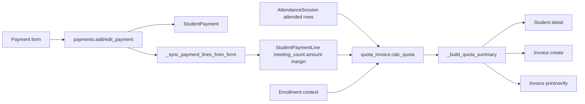

# Student Payment To Quota To Invoice

## Purpose

Keep paid sessions, used sessions, remaining quota, invoice lines, and student detail summaries aligned from one source of truth.

## Source Of Truth

- Bought sessions: `StudentPaymentLine.meeting_count` in `app/models/payment.py`
- Payment header: `StudentPayment` in `app/models/payment.py`
- Used sessions: attended `AttendanceSession` rows in `app/models/attendance.py`
- Enrollment context: `Enrollment` and `EnrollmentSchedule` in `app/models/enrollment.py`
- Invoice state: invoice models and routes under `app/routes/quota_invoice.py`

## Entry Points

- `app/routes/payments.py`: `add_payment`, `edit_payment`, `verify_payment`, `payment_invoice`
- `app/routes/quota_invoice.py`: `calc_quota`, `_get_student_quota_details`, `_build_quota_summary`, `refresh_student_quota`, `create_invoice`, `invoice_detail`, `invoice_verify`, `invoice_print`
- `app/routes/master.py`: `student_detail`

## Route And Service Path

1. Payment form saves `StudentPayment`.
2. Payment form synchronizes `StudentPaymentLine` rows through `_sync_payment_lines_from_form`.
3. Quota reads bought sessions from payment lines and used sessions from attendance rows.
4. Student detail, quota alert, invoice creation, invoice print, and invoice verification consume the same quota summary.
5. Refresh action recomputes visible quota from canonical rows when historical data may be stale.

## User-Facing Surfaces

- Student payment list/detail/edit
- Student detail quota summary
- Quota alerts
- Invoice create/detail/verify/print
- Payment invoice/receipt

## Invariants

- Invoice math and student detail quota must use the same cumulative session source.
- Editing a payment must rebuild payment lines, not only update the payment header.
- Used sessions come from attendance, not from invoice status.
- Remaining sessions are calculated, not manually entered.
- Historical payment and attendance records must remain auditable.

## Known Fragility

- Payment header changes without line synchronization can leave stale bought-session totals.
- Month-only quota shortcuts are unsafe because invoices need cumulative enrollment/session history.
- Any new invoice path must call the same quota calculation helpers.

## Required Checks

- `openspec validate --specs --strict --no-interactive`
- Focused quota/payment/invoice tests, especially `tests/test_quota_total_sessions.py` when available
- Route bootstrap or container test when changing route imports or app startup
- Manual UI check for student detail and invoice if templates change

## Diagram

