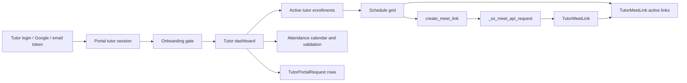

# Tutor Dashboard To SS Meet

## Purpose

Map the tutor portal dashboard, visible teaching schedule, attendance calendar, active meeting links, and SS Meet link creation flow.

## Source Of Truth

- Tutor identity and credentials: `Tutor` in `app/models/master.py`
- Portal session: tutor portal session keys in `app/routes/tutor_portal.py`
- Tutor request records: `TutorPortalRequest` in `app/models/tutor_portal.py`
- Meeting links: `TutorMeetLink` in `app/models/tutor_portal.py`
- Enrollment/schedule context: `Enrollment` and `EnrollmentSchedule`
- Attendance calendar context: `AttendanceSession`
- SS Meet API response: consumed through `_ss_meet_api_request`

## Entry Points

- Login and onboarding: `login`, `google_login`, `google_callback`, `verify`, `verify_email`, `onboarding`, `logout`
- Admin tutor dashboard selection: `admin_dashboard_select`
- Tutor dashboard: `dashboard`
- SS Meet link creation: `create_meet_link`
- Schedule/profile requests: `request_schedule_change`, `request_availability`, `request_profile_update`
- Admin request review: `admin_requests`, `admin_request_detail`, `review_request`, `_apply_approved_request`

## Route And Service Path

1. Tutor authenticates through portal credentials, email token, or Google callback.
2. Portal checks onboarding and selected admin view state.
3. Dashboard builds tutor-scoped enrollments, attendance calendar, presensi schedule grid, validated attendance, request rows, and active meet links.
4. Active meet links are fetched through `_active_meet_links_for_enrollments` and attached to the schedule grid through `_attach_meet_links_to_schedule_grid`.
5. Tutor or admin creates a meet link through `create_meet_link`, which calls `_ss_meet_api_request`.
6. The resulting meeting link is stored in `TutorMeetLink` and shown on the tutor dashboard while active.

## User-Facing Surfaces

- Tutor login, Google login, email verification, onboarding
- Tutor dashboard root `/tutor/`
- Tutor attendance calendar and presensi schedule grid
- Meeting link buttons and active link display
- Admin dashboard-select mode
- Tutor request forms and admin request review pages

## Invariants

- Tutors must only see their own enrollments, schedules, attendance, uploads, requests, and meet links.
- Admin-selected tutor dashboard view must remain read-limited to authorized admin users.
- SS Meet link creation must be tied to an active enrollment context.
- Stored meet links must have enough metadata to determine whether they are active.
- Schedule/profile requests must not mutate operational data until approved.
- External SS Meet errors must not corrupt existing schedule or attendance records.

## Known Fragility

- Dashboard combines many contexts: tutor credentials, onboarding, attendance, enrollments, schedules, requests, WhatsApp status, and SS Meet.
- Meeting windows and active link expiration depend on time normalization.
- Admin dashboard-select mode must not accidentally grant mutation access to tutor-only actions.
- SS Meet API configuration is external and may fail independently of the Flask app.

## Required Checks

- `openspec validate --specs --strict --no-interactive`
- `tests/test_tutor_portal.py` or focused tutor portal tests when dashboard, request, or credential behavior changes
- Container route bootstrap when tutor portal imports or app startup change
- Secret-redacted SS Meet configuration check when API integration changes
- Manual dashboard check if templates or meet-link rendering change

## Diagram

