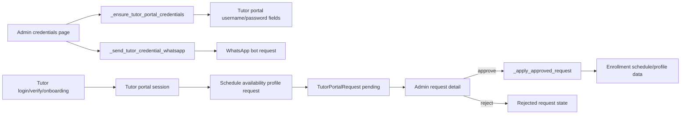

# Tutor Portal Credentials And Requests

## Purpose

Map tutor portal credential generation, onboarding, WhatsApp credential delivery, schedule/profile requests, admin review, and approved request application.

## Source Of Truth

- Tutor identity and portal credential fields: `Tutor` in `app/models/master.py`
- Portal requests: `TutorPortalRequest` in `app/models/tutor_portal.py`
- Tutor session and admin-selected tutor view: session keys managed in `app/routes/tutor_portal.py`
- WhatsApp credential delivery: `_send_tutor_credential_whatsapp` via `_bot_request`
- Schedule mutations: enrollment schedule rows updated through approved request application

## Entry Points

- Credential creation helpers: `_portal_username_base`, `_initial_portal_password`, `_ensure_tutor_portal_credentials`, `_ensure_all_tutor_portal_credentials`
- Login/onboarding: `login`, `verify`, `verify_email`, `onboarding`, `logout`
- Admin credential pages/actions: `admin_credentials`, `admin_send_bulk_credential_whatsapp`, `admin_reset_bulk_credential_passwords`, `admin_send_credential_whatsapp`, `admin_reset_credential_password`
- Tutor requests: `request_schedule_change`, `request_availability`, `request_profile_update`
- Admin review: `admin_requests`, `admin_request_detail`, `review_request`, `_apply_approved_request`

## Route And Service Path

1. Admin or login flow ensures tutor portal credentials exist.
2. Credentials can be sent through WhatsApp using a rendered credential template and bot request.
3. Tutor logs in, verifies email when needed, completes onboarding, and accesses dashboard.
4. Tutor submits schedule, availability, or profile requests.
5. Admin reviews request detail and accepts or rejects.
6. Approved request payload is applied through `_apply_approved_request`, while rejected/pending requests do not mutate operational data.

## User-Facing Surfaces

- Tutor login and onboarding pages
- Tutor dashboard request forms
- Admin dashboard-select mode
- Admin credentials page
- Admin request list and request detail pages
- WhatsApp credential messages

## Invariants

- Portal credentials must be generated deterministically enough for admin management but stored securely.
- Password reset must not expose hidden hashes; only intended visible password messages can be sent.
- WhatsApp credential delivery must not print credentials in logs.
- Tutor requests must remain pending until admin approval.
- Admin view mode must not allow unauthorized tutor-scope mutation.
- Approved schedule changes must preserve enrollment/tutor context.

## Known Fragility

- Credential reset and WhatsApp send are separate actions; failure in one should not imply success in the other.
- Schedule request payloads can become stale if enrollments change before approval.
- Admin-selected tutor dashboard mode overlaps with normal tutor session behavior and must stay constrained.

## Required Checks

- `openspec validate --specs --strict --no-interactive`
- Focused tutor portal tests, especially credential, onboarding, request, and admin review paths
- Secret-redacted WhatsApp bot configuration check when credential messaging changes
- Container bootstrap when tutor portal imports or route registration changes

## Diagram

