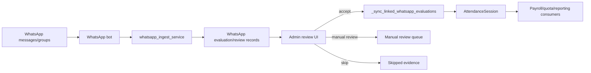

# WhatsApp Attendance To Presensi

## Purpose

Keep WhatsApp evidence, contact/group validation, manual review, and attendance synchronization safe from duplicates and wrong matches.

## Source Of Truth

- WhatsApp bot session/auth state: persistent bot volume and bot service
- WhatsApp evidence/review records: WhatsApp models under `app/models/whatsapp.py`
- Accepted attendance record: `AttendanceSession`
- Tutor portal and admin request context: `app/routes/tutor_portal.py` and `app/routes/whatsapp.py`

## Entry Points

- `app/routes/attendance.py`: `scan_whatsapp_attendance`, `review_whatsapp_attendance`, `bulk_review_whatsapp_attendance`, `_sync_linked_whatsapp_evaluations`
- `app/routes/tutor_portal.py`: credential WhatsApp helpers, bot request helpers, attendance validation map
- `app/routes/whatsapp.py`: bot/admin WhatsApp pages and backup/session actions
- `app/services/whatsapp_ingest_service.py`: ingestion and matching logic
- WhatsApp bot container: messaging, session, and evidence input

## Route And Service Path

1. Bot receives or scans WhatsApp evidence.
2. Ingestion logic normalizes contact, phone, group, student, tutor, lesson date, and confidence data.
3. Admin review accepts, skips, or marks manual review for ambiguous evidence.
4. Accepted evidence syncs to attendance and links back to the WhatsApp evaluation.
5. Attendance delete/edit paths must unlink or update linked WhatsApp evidence carefully.

## User-Facing Surfaces

- WhatsApp bot dashboard
- Attendance WhatsApp review UI
- Attendance list/detail/calendar
- Tutor credential WhatsApp actions
- Backup/restore controls for WhatsApp session artifacts

## Invariants

- Ambiguous WhatsApp evidence must not silently become attendance.
- Linked evidence must not create duplicate attendance rows.
- Deleting attendance must handle linked WhatsApp evaluations deliberately.
- Secrets, tokens, passwords, and session files must not be printed.

## Known Fragility

- Phone numbers, group names, and student/tutor names can be ambiguous.
- Bot session state is operationally critical and must be backed up.
- Manual review status must remain visible so uncertain evidence is not forgotten.

## Required Checks

- Attendance review tests or focused route checks when review logic changes
- Bot/session status check after WhatsApp service changes
- Secret-redacted logs only
- Container checks for both web/tutor web and WhatsApp bot when integration changes

## Diagram

